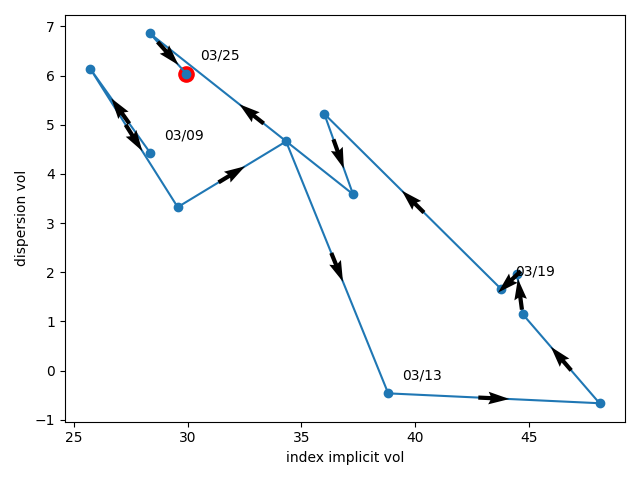
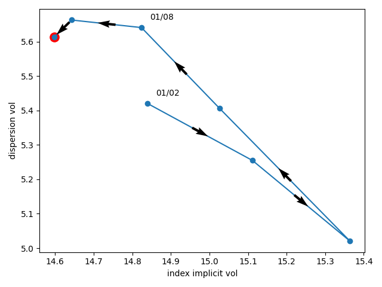
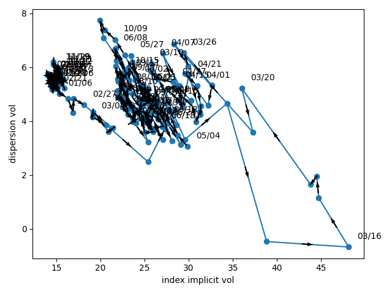

# Timing-Dispersion-Strategy-requires-Deutsche-Boerse-A7-access
A simple way to know when to enter dispersion strategy

A Dispersion Strategy is a way for option traders to take advantage of the premium in index implicit volatility compared to single stock's volatility.
This premium comes from different dominating flows in each asset class ;
- Global hedge on index
- Overwriting strategies on single stocks

See a more detailed explanation at :
https://blog.quantinsti.com/dispersion-trading-using-options/#:~:text=The%20Dispersion%20Trading%20is%20a,than%20between%20individual%20stock%20options.

A dispersion strategy can be equated to trading the correlation intra index but it is a misleading idea.
The purest form of dispersion is via Varswap on index vs Varswap on underlyings.
This is not how it is traded nowadays though as they are deemed too dangerous in market dislocation scenarios but they can be partially replicated through static options strategy so it is still a good benchmark to evaluate a dispersion strategy.

Hence the Dispersion Volatility measure :

Dispersion_Vol = ( Sum(i=1..50, Wi * ATFi^2) - (1+Leverage) * ATFindex^2 ) / Normalisation_factor

where

ATFi is the ATM implicit vol of the ith stock in the index
ATFindex is the ATM implicit vol of the index
Leverage is the additional notional of index varswap to sell in order to get a vega neutral dispersion.
Wi is the weight of the ith component in the index
Normalisation_factor is a factor to apply to get a vega of 1 on the index so : 2 * (1+Leverage) * ATFindex

Explanation :
It is a measure of the price of a varswap dispersion strategy with a leverage on the index in order to target a vega neutral portfolio.
Finally, the Normalisation Factor sets a vega of 1 on the index for readability purposes.

This indicator can of course also be computed in a realized form instead of implicit, by inputing realized volatilities. 
The PnL of the dispersion strategy will then be very straight forward :
PnL = Dispersion_Vol_Realized - Dispersion_Vol_Implicit

Consequently, the lower the implicit Dispersion_Vol, the higher the chances of positive reward.

What we will be doing :
Option traders know that when markets collapse, the index vol overshoots the vol of components which create dispersion trade opportunities.
Visually, this creates a clockwise patterns on a graph representing the Dispersion_Vol on the Y axis and the index implicit vol on the X axis in case of market stress :
- First index vol rises and overshoots stock vol so the dispersion vol goes down movement to the bottom right.
- Then the stock vol rises pushing the disp vol higher so the curve moves up.
- Finally, the market settles and reverts to its original level completing the anti clockwise trajectory.

The goal of this git is show how to create this graph using Deutsche Boerse's A7 API.

Here are some examples :

March 2020 market meltdown :

January 2020 :

Nov 2019 to Oct 2020 :

